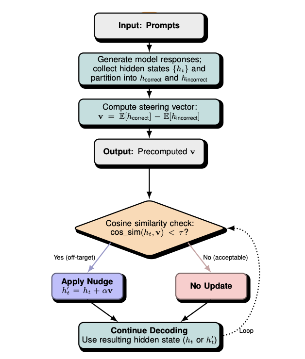

# Amortized Latent Steering (ALS) for Efficient LLM Reasoning

<p align="center">
  
</p>

This repository contains the implementation of **Amortized Latent Steering (ALS)**, a method for efficient and interpretable test-time guidance of large language models (LLMs). ALS pre-computes a single steering vector from a small training set to guide model reasoning, dramatically reducing test-time compute compared to instance-level optimization methods.

-----

## Installation

First, create and activate a conda environment.

```bash
# Create and activate the conda environment
conda create -n als python=3.10
conda activate als

# Install core dependencies
pip install torch torchvision torchaudio
pip install transformers datasets tqdm accelerate termcolor matplotlib

# Install dependencies for math evaluation
cd src/extract_judge_answer/latex2sympy
pip install -e .
cd ../../.. 
pip install math-verify word2number
```

-----

## Workflow

The project is structured around a three-phase workflow: collecting states, computing a steering vector, and running guided generation.

### Step 1: Collect Hidden States (Offline)

First, collect hidden states from a small training set and label the model's responses as "good" or "bad."

  * **GSM8K:** first 1,000 training examples
  * **MATH-500:** first 500 training examples

Run the `collect_states.py` script for each model and dataset combination. You can switch between prompts by changing `--solver_prompt_idx`.

```bash
# Example for Llama-3.1-8B on GSM8K with prompt 1
python src/collect_states.py \
    --model_name_or_path /path/to/Llama-3.1-8B-Instruct \
    --dataset "openai/gsm8k" \
    --split "train" \
    --solver_prompt_idx 0 \
    --end_data_idx 1000 \
    --resume
```

### Step 2: Compute Steering Vector

Next, compute the steering vector from the collected hidden states.

```bash
# Example for Qwen on MATH-500
python src/compute_steering_vector.py \
    --states_dir "./output/Qwen2.5-7B-Instruct-MATH-500/state_collection/prompt1_thresh3/hidden_states/" \
    --output_file "./vectors/qwen_math500_p1_thresh3.pt"
```

### Step 3: Run Guided Generation (Online)

Finally, use the pre-computed steering vector to guide the LLM's generation at test time.

#### **ALS (steered)**

This is the main, efficient steering mode.

```bash
python src/main.py \
    --generation_mode steered \
    --model_name_or_path /path/to/Llama-3.1-8B-Instruct \
    --dataset "openai/gsm8k" \
    --split "test" \
    --output_dir "./output" \
    --vector_name_template "./vectors/llama_gsm8k_p{prompt_idx}_thresh3.pt" \
    --prompts_to_run 0
```

#### **ALS-Gated**

A variant that applies steering selectively, useful for structured outputs.

```bash
python src/main.py \
    --generation_mode als_gated \
    --model_name_or_path /path/to/Qwen2.5-7B-Instruct \
    --dataset "MATH-500" \
    --split "test" \
    --output_dir "./output" \
    --vector_name_template "./vectors/qwen_math500_p{prompt_idx}_thresh3.pt" \
    --prompts_to_run 1 \
    --fixed_subset_path ./subsets/HuggingFaceH4-MATH-500_test200.txt
```

-----

## Baselines & Ablations

This repository includes scripts to run baselines and ablation studies for comparison.

### Baselines

Run standard generation methods like **Greedy CoT**, **Self-Consistency**, or the original **LatentSeek** optimization.

```bash
# Example for LatentSeek baseline
python src/main.py \
    --generation_mode latentseek \
    --model_name_or_path /path/to/Qwen2.5-7B-Instruct \
    --dataset "openai/gsm8k" \
    --split "test" \
    --output_dir "./output" \
    --end_data_idx 500
```

### Ablation Studies

You can perform sweeps to analyze the effect of steering strength (`--alpha`).

```bash
# Example: Alpha sweep on a 200-example subset of GSM8K
python src/main.py \
    --generation_mode steered \
    --model_name_or_path /path/to/Qwen2.5-7B-Instruct \
    --dataset "openai/gsm8k" \
    --fixed_subset_path "./subsets/openai-gsm8k_test_200.txt" \
    --output_dir "./output" \
    --vector_name_template "./vectors/qwen_gsm8k_p{prompt_idx}.pt" \
    --alpha 0.3 # Test values like 0.0, 0.1, 0.3, 0.6
```

-----

## Utilities

### Creating Subsets

Generate fixed subsets for consistent ablation testing.

```bash
# GSM8K, 100 examples
python create_subsets.py \
    --dataset_name "openai/gsm8k" \
    --split "test" --n_samples 100 \
    --output_dir "./subsets"
```

### Visualization

Generate plots to visualize rolling accuracy from a log file.

```bash
python create_chart.py \
    --log_file "./output/Meta-Llama-3.1-8B-Instruct-openai/gsm8k/steered_eval/prompt_0/logistics.pt" \
    --output_dir "./charts"
```

-----

## Key Files

  * `src/main.py`: Main script for running generation and evaluation.
  * `src/collect_states.py`: Collects hidden states for ALS.
  * `src/compute_steering_vector.py`: Computes the steering vector.
  * `src/steered_generation.py`: Core implementation of ALS.
  * `src/opt_generation.py`: Original LatentSeek implementation.
  * `src/prompts/`: Contains all prompt templates.

## Notes

  * Use the `--resume` flag to continue interrupted runs.
  * The `--prompts_to_run` argument can be used to select a specific prompt index.
  * Subsets and sweep commands are provided for full reproducibility.

For any questions, please email `egbunanathan@gmail.com`.
